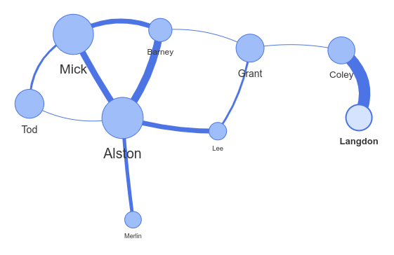

# vis-network



Network is a visualization to display networks and networks consisting of nodes and edges. The visualization is easy to use and supports custom shapes, styles, colors, sizes, images, and more. The network visualization works smooth on any modern browser for up to a few thousand nodes and edges. To handle a larger amount of nodes, Network has clustering support. Network uses HTML canvas for rendering.

## Badges

[](https://github.com/semantic-release/semantic-release)
[](https://app.renovatebot.com/)
[](https://www.npmjs.com/package/vis-network)

[](https://david-dm.org/visjs/vis-network)
[](https://david-dm.org/visjs/vis-network?type=dev)
[](https://david-dm.org/visjs/vis-network?type=peer)

[](https://github.com/visjs/vis-network/graphs/contributors)
[](#backers)
[](#sponsors) 

## Install

Install via npm:

    $ npm install vis-network

## Example

A basic example on loading a Network is shown below. More examples can be
found in the [examples directory](https://github.com/visjs/vis-network/tree/master/examples/)
of the project.

```html
<!doctype html>
<html>
<head>
  <title>Network</title>
  <script type="text/javascript" src="https://unpkg.com/vis-network/standalone/umd/vis-network.min.js"></script>
  <style type="text/css">
    #mynetwork {
      width: 600px;
      height: 400px;
      border: 1px solid lightgray;
    }
  </style>
</head>
<body>
<div id="mynetwork"></div>
<script type="text/javascript">
  // create an array with nodes
  var nodes = new vis.DataSet([
    {id: 1, label: 'Node 1'},
    {id: 2, label: 'Node 2'},
    {id: 3, label: 'Node 3'},
    {id: 4, label: 'Node 4'},
    {id: 5, label: 'Node 5'}
  ]);

  // create an array with edges
  var edges = new vis.DataSet([
    {from: 1, to: 3},
    {from: 1, to: 2},
    {from: 2, to: 4},
    {from: 2, to: 5},
    {from: 3, to: 3}
  ]);

  // create a network
  var container = document.getElementById('mynetwork');
  var data = {
    nodes: nodes,
    edges: edges
  };
  var options = {};
  var network = new vis.Network(container, data, options);
</script>
</body>
</html>
```

## Build

To build the library from source, clone the project from github

    $ git clone git://github.com/visjs/vis-network.git

The source code uses the module style of node (require and module.exports) to
organize dependencies. To install all dependencies and build the library,
run `npm install` in the root of the project.

    $ cd vis-network
    $ npm install

Then, the project can be build running:

    $ npm run build

## Test

To test the library, install the project dependencies once:

    $ npm install

Then run the tests:

    $ npm run test

## Contribute

Contributions to the vis.js library are very welcome! We can't do this alone!

### Backers

Thank you to all our backers! 🙏

<a href="https://opencollective.com/visjs#backers" target="_blank"></a>

### Sponsors

Support this project by becoming a sponsor. Your logo will show up here with a link to your website.

<a href="https://opencollective.com/visjs/sponsor/0/website" target="_blank"></a>
<a href="https://opencollective.com/visjs/sponsor/1/website" target="_blank"></a>
<a href="https://opencollective.com/visjs/sponsor/2/website" target="_blank"></a>
<a href="https://opencollective.com/visjs/sponsor/3/website" target="_blank"></a>
<a href="https://opencollective.com/visjs/sponsor/4/website" target="_blank"></a>
<a href="https://opencollective.com/visjs/sponsor/5/website" target="_blank"></a>
<a href="https://opencollective.com/visjs/sponsor/6/website" target="_blank"></a>
<a href="https://opencollective.com/visjs/sponsor/7/website" target="_blank"></a>
<a href="https://opencollective.com/visjs/sponsor/8/website" target="_blank"></a>
<a href="https://opencollective.com/visjs/sponsor/9/website" target="_blank"></a>

## License

Copyright (C) 2010-2018 Almende B.V. and Contributors

Vis.js is dual licensed under both

  * The Apache 2.0 License
    http://www.apache.org/licenses/LICENSE-2.0

and

  * The MIT License
    http://opensource.org/licenses/MIT

Vis.js may be distributed under either license.
